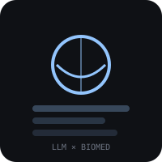

# Awesome LLM for Biomedicine 

Large language models, datasets, tools, and benchmarks for biomedical and clinical applications.

PRs welcome — [suggest a resource](https://github.com/infonality/awesome-llm-biomedicine/issues/new).

---

## Contents

- [Clinical LLMs](#clinical-llms)
- [Vision-Language Models](#vision-language-models)
- [Genomics LLMs](#genomics-llms)
- [Drug Discovery & Molecular LLMs](#drug-discovery--molecular-llms)
- [Protein & Structural Biology LLMs](#protein--structural-biology-llms)
- [Benchmarks & Datasets](#benchmarks--datasets)
- [Shared Tasks & Challenges](#shared-tasks--challenges)
- [LLM Agents & Toolkits](#llm-agents--toolkits)
- [Tools & Libraries](#tools--libraries)
- [Key Papers](#key-papers)
- [Ontologies & Knowledge Bases](#ontologies--knowledge-bases)
- [Courses & Tutorials](#courses--tutorials)
- [Glossary](#glossary)

---

## Clinical LLMs

Pre-trained models fine-tuned on clinical notes, EHR data, and medical literature.

- [BioBERT](https://github.com/dmis-lab/biobert) - 110M params. PubMed + PMC. Early biomedical BERT; widely cited.
- [BioGPT](https://github.com/microsoft/BioGPT) - 1.5B params. PubMed + papers. Microsoft's generative model for biomedical text generation and mining.
- [BioMedLM (PubMedGPT)](https://huggingface.co/stanford-crfm/BioMedLM) - 2.7B params. Stanford CRFM; domain-specific from scratch.
- [BioMistral](https://huggingface.co/BioMistral/BioMistral-7B) - 7B params. PubMed Central. Mistral-based open biomedical LLM.
- [ClinicalBERT](https://huggingface.co/emilyalsentzer/Bio_ClinicalBERT) - 110M params. MIMIC-III discharge summaries. BERT fine-tuned on clinical notes.
- [ClinicalLongformer](https://huggingface.co/yikao810/ClinicalLongformer) - 4K context. Clinical notes. Long-context clinical model for full notes.
- [GatorTron](https://arxiv.org/abs/2203.03560) - 3.9B/8.9B params. 90B tokens (clinical + PubMed). Large clinical model from UF Health.
- [HuatuoGPT](https://github.com/FreedomIntelligence/HuatuoGPT) - 7B/13B/33B params. Chinese medical LLM fine-tuned on real physician dialogues.
- [HuatuoGPT-II](https://github.com/FreedomIntelligence/HuatuoGPT-II) - 7B/13B/34B params. One-stage medical adaptation; SOTA on Chinese medical benchmarks.
- [Med-PaLM 2](https://arxiv.org/abs/2305.09617) - Google's medical LLM. Achieves USMLE-level performance; not open-weight.
- [MedGemma](https://github.com/google-health/medgemma) - 4B/27B params. Google's open-weight medical LLM built on Gemma 3. The 4B variant is multimodal (text + medical imaging); 27B is text-only.
- [MEDITRON](https://huggingface.co/epfl-llm/meditron-7b) - 7B/70B params. Medical papers + guidelines. EPFL; open-weight, clinical reasoning.
- [MedLlama](https://huggingface.co/medicalai/ClinicalBERT) - Clinical NLP models from medicalai.
- [MMedLM 2](https://github.com/MAGIC-AI4Med/MMedLM) - Multilingual medical LLM. Supports 8 languages; trained on 25.5B tokens of multilingual medical corpus. Nature Communications.
- [OpenBioLLM](https://huggingface.co/aaditya/OpenBioLLM-Llama3-8B) - 8B/70B params. Llama-3 fine-tuned on biomedical data. Achieves strong results on medical benchmarks.
- [PMC-LLaMA](https://huggingface.co/axiong/PMC_LLaMA_13B) - 7B/13B params. PubMed Central. LLaMA fine-tuned on biomedical literature.
- [PubMedBERT](https://huggingface.co/microsoft/PubMedBERT) - 110M params. PubMed abstracts (from scratch). Strong baseline for biomedical NLP.

## Vision-Language Models

Multimodal models for biomedical imaging, radiology, pathology, and medical visual question answering.

- [BiomedCLIP](https://huggingface.co/microsoft/BiomedCLIP-PubMedBERT_256-vit_base_patch16_224) - Biomedical vision-language foundation model pretrained on PMC-15M (15M image-text pairs). PubMedBERT text encoder + ViT image encoder.
- [BiomedGPT](https://github.com/taokz/BiomedGPT) - Generalist vision-language foundation model for diverse biomedical tasks. Nature Medicine 2024.
- [HuatuoGPT-Vision](https://github.com/FreedomIntelligence/HuatuoGPT-Vision) - Medical multimodal LLM. Injects medical visual knowledge at scale; 7B/34B params.
- [LLaVA-Med](https://github.com/microsoft/LLaVA-Med) - Biomedical vision-language assistant trained on PMC-15M. Curriculum learning for medical VQA. Microsoft Research.

## Genomics LLMs

Foundation models for single-cell RNA-seq, DNA sequences, and genomics.

- [Caduceus](https://github.com/kuleshov-group/caduceus) - DNA sequences. Reversible and bi-directional DNA sequence modeling.
- [DNABERT-2](https://github.com/MAGICS-LAB/DNABERT_2) - 117M params. DNA sequences. Improved genome understanding model.
- [Geneformer](https://huggingface.co/ctheodoris/geneformer) - 95M params. scRNA-seq. Foundation model for transcriptomics; pre-trained on 30M cells.
- [HyenaDNA](https://github.com/HazyResearch/hyena-dna) - 1K-1M context. DNA sequences. Ultra-long-context genomic model.
- [Nucleotide Transformer](https://huggingface.co/InstaDeepAI/nucleotide-transformer-2.5b-multi-species) - 500M-2.5B params. DNA sequences. Multi-species DNA foundation model.
- [scGPT](https://github.com/bowang-lab/scGPT) - ~50M params. scRNA-seq. Single-cell foundation model; cell type annotation, perturbation prediction.
- [scBERT](https://github.com/TencentAILabHealthcare/scBERT) - Single-cell type annotation using BERT-style pre-training.
- [UmiFormer](https://arxiv.org/abs/2305.02110) - Transformer for single-cell RNA-seq cell type annotation.

## Drug Discovery & Molecular LLMs

Models for molecular property prediction, drug-drug interaction, and chemical generation.

- [ChemBERTa](https://huggingface.co/seyonec/ChemBERTa-zinc-base-v1) - SMILES molecules. RoBERTa for molecular property prediction.
- [Chemformer](https://github.com/MolecularAI/Chemformer) - SMILES to reactions. Transformer for retrosynthesis.
- [Galactica](https://huggingface.co/facebook/galactica-120b) - Scientific text + molecules. Meta's science LLM (deprecated but influential).
- [MolT5](https://github.com/blender-nlp/MolT5) - Molecule to text. T5 for molecule captioning and generation.
- [MolReGPT](https://arxiv.org/abs/2310.17341) - LLM-based molecular generation via prompt engineering with SMILES.
- [Uni-Mol](https://github.com/dptech-corp/Uni-Mol) - 3D molecular. 3D molecular representation model.

## Protein & Structural Biology LLMs

- [ESM-2](https://github.com/facebookresearch/esm) - 650M-15B params. Protein sequences. Meta's protein language model; structure prediction.
- [ESM3](https://www.evolutionaryscale.ai/blog/esm3-release) - Protein language model from EvolutionaryScale for generative protein design.
- [ProGen2](https://github.com/anonymized-research/progen2) - 6.4B-151B params. Protein sequences. Generative protein design model.
- [ProtTrans](https://huggingface.co/Rostlab/prot_bert_bfd) - 420M-3B params. Protein sequences. Transformer for protein sequences.
- [RoseTTAFold](https://github.com/RosettaCommons/RoseTTAFold) - Protein structure. 3D protein structure prediction (non-LLM but essential).
- [SaProt](https://github.com/westlake-repl/SaProt) - 650M params. Protein (folded). Structure-aware protein model.

## Benchmarks & Datasets

### Clinical Text

- [BioASQ](http://bioasq.org/) - QA, retrieval. ~5K questions. Biomedical question answering benchmark.
- [BlueBERT benchmark suite](https://github.com/ncbi-nlp/BlueBERT) - Multiple tasks. NCBI's benchmark suite for biomedical language understanding.
- [MedQA (USMLE)](https://github.com/jind11/MedQA) - QA. 12.7K questions. US medical licensing exam questions.
- [MedMCQA](https://github.com/MedMCQA/MedMCQA) - QA. 194K questions. Indian medical entrance exam MCQs.
- [MedXpertQA](https://github.com/TsinghuaC3I/MedXpertQA) - QA. 4,460 questions. Expert-level medical reasoning benchmark. ICML 2025. Text and multimodal subsets.
- [MIMIC-III / MIMIC-IV](https://physionet.org/content/mimiciv/) - Clinical notes, tables. 2M+ notes. Most-used clinical text corpus; requires training + CITI.
- [MMLU (medical subsets)](https://github.com/hendrycks/test) - MCQ. 1K+ per subject. Clinical knowledge evaluation; widely used in LLM benchmarks.
- [PubMedQA](https://github.com/pubmedqa/pubmedqa) - QA. 1K expert + 211K unlabeled. QA over PubMed abstracts.

### Relation Extraction & Drug Interactions

- [ADE Corpus](https://huggingface.co/datasets/ade_corpus_v2) - Adverse drug events. 3,000+ sentences.
- [ChemProt](https://github.com/arwhirang/recursive_chemprot) - Chemical-protein RE. 1,820 abstracts.
- [DDI Corpus](https://github.com/yardstick17/DDIExtraction) - Drug-drug interaction. 792 documents.
- [EU-ADR](https://github.com/mi-erasmusmc/EU-ADR-Corpus) - Drug-adverse effect. 3,000 sentences.
- [GAD (Genetic Association Database)](https://academic.oup.com/bioinformatics/article/25/18/2486/194116) - Gene-disease association. 5,330+ sentences.

### Genomics

- [CellxGene](https://cellxgene.cziscience.com/) - scRNA-seq census. 50M+ cells. Chan Zuckerberg Initiative; largest single-cell atlas.
- [GEO](https://www.ncbi.nlm.nih.gov/geo/) - Gene expression. 20M+ samples. Gene Expression Omnibus.
- [Tabula Sapiens](https://tabula-sapiens.ds.czbiohub.org/) - scRNA-seq. 500K+ cells. Multi-organ human cell atlas.

### Agent Benchmarks

- [MedAgentBench](https://stanfordmlgroup.github.io/projects/medagentbench) - Agent evaluation. 300 physician-written tasks across 10 categories. FHIR-compliant EHR environment.

## Shared Tasks & Challenges

- [BioASQ Challenge](https://github.com/dmis-lab/bioasq-biobert) - Biomedical QA and retrieval. 2013-present.
- [BioNLP Shared Task](https://aclanthology.org/venues/bionlp/) - Event extraction from biomedical text. 2009-2023.
- [MEDIQA](https://github.com/abachaa/MEDIQA2019) - Medical text generation and summarization. 2019.
- [MedNLI](https://github.com/jgc128/mednli) - Natural language inference in clinical text. 2018.
- [n2c2 / i2b2 challenges](https://portal.dbmi.hms.harvard.edu/projects/n2c2-2024/) - Clinical NLP challenges. 2007-present.
- [TAC ADR Extraction](https://tac.nist.gov/) - ADR extraction from drug labels. 2017. (NIST TAC archive)

## LLM Agents & Toolkits

LLM-based agents for clinical reasoning, therapeutic decision-making, and medical research.

- [TxAgent](https://github.com/mims-harvard/TxAgent) - AI agent for therapeutic reasoning. Multi-step reasoning with 211 biomedical tools. Harvard; outperforms GPT-4o on drug reasoning tasks.

## Tools & Libraries

- [BERN2](https://github.com/dmis-lab/bern) - Biomedical NER. Multi-type entity recognition (disease, drug, gene, etc.).
- [BigBIO](https://github.com/bigscience-workshop/biomedical) - Dataset loading. Unified access to 160+ biomedical datasets.
- [BioC](https://pypi.org/project/bioc/) - Biomedical text format. XML/JSON interchange format for biomedical text.
- [BioGPT inference](https://huggingface.co/microsoft/biogpt) - Text generation. Microsoft's biomedical generative model.
- [cTAKES](https://ctakes.apache.org/) - Clinical NLP. Clinical Text Analysis Knowledge Extraction System.
- [MedSpaCy](https://github.com/medspacy/medspacy) - Clinical NLP pipeline. Clinical text processing, section detection.
- [scispaCy](https://github.com/allenai/scispacy) - Biomedical NLP pipeline. spaCy models for biomedical NER, linking.

## Key Papers

### Clinical LLMs

- BioBERT: Lee et al. (2020). BioBERT: a pre-trained biomedical language representation model for biomedical text mining. [arXiv:1901.08746](https://arxiv.org/abs/1901.08746)
- BioGPT: Luo et al. (2022). BioGPT: generative pre-trained transformer for biomedical text generation and mining. [arXiv:2210.17100](https://arxiv.org/abs/2210.17100)
- ClinicalBERT: Alsentzer et al. (2019). Publicly Available Clinical BERT Embeddings. [arXiv:1904.03323](https://arxiv.org/abs/1904.03323)
- HuatuoGPT: Zhang et al. (2023). HuatuoGPT, towards Taming Language Model to Be a Doctor. [arXiv:2305.15075](https://arxiv.org/abs/2305.15075)
- Med-PaLM: Singhal et al. (2023). Large language models encode clinical knowledge. [arXiv:2212.13138](https://arxiv.org/abs/2212.13138)
- MedGemma: Golden et al. (2025). MedGemma: Open Weight Medical LLMs. [arXiv:2507.05201](https://arxiv.org/abs/2507.05201)
- MEDITRON: Chen et al. (2023). MEDITRON-70B: Scaling Medical Pretraining of Language Models. [arXiv:2311.18279](https://arxiv.org/abs/2311.18279)
- MMedLM: Qiu et al. (2024). Towards Building Multilingual Language Model for Medicine. [Nature Communications](https://www.nature.com/articles/s41467-024-52417-z)
- OpenBioLLM: Rahman et al. (2024). OpenBioLLM: Leveraging Open Access Data to Build Specialized Medical LLMs. [arXiv:2405.17364](https://arxiv.org/abs/2405.17364)
- PubMedBERT: Gu et al. (2021). Domain-Specific Language Model Pretraining for Biomedical Natural Language Processing. [arXiv:2007.15779](https://arxiv.org/abs/2007.15779)

### Vision-Language Models

- BiomedCLIP: Zhang et al. (2024). Large-Scale Domain-Specific Pretraining for Biomedical Vision-Language Processing. [arXiv:2303.00915](https://arxiv.org/abs/2303.00915)
- BiomedGPT: Zhang et al. (2024). A generalist vision-language foundation model for diverse biomedical tasks. [Nature Medicine](https://www.nature.com/articles/s41591-024-03185-2)
- LLaVA-Med: Li et al. (2023). LLaVA-Med: Training a Large Language-and-Vision Assistant for Biomedicine in One Day. [arXiv:2306.00890](https://arxiv.org/abs/2306.00890)

### Genomics LLMs

- Geneformer: Theodoris et al. (2023). Transfer learning enables predictions in network biology. [Nature](https://www.nature.com/articles/s41586-023-06139-9)
- Nucleotide Transformer: Dalla-Torre et al. (2024). The Nucleotide Transformer: Building and Evaluating Robust Foundation Models for Human Genomics. [Nature Methods](https://www.nature.com/articles/s41592-024-02330-3)
- scGPT: Cui et al. (2024). scGPT: Toward Building a Foundation Model for Single-Cell Multi-omics Using Single-Cell Transcriptomics. [Nature Methods](https://www.nature.com/articles/s41592-024-02205-7)

### Drug Discovery

- ChemBERTa: Chithrananda et al. (2020). ChemBERTa: Large-Scale Self-Supervised Pretraining for Molecular Property Prediction. [arXiv:2010.09885](https://arxiv.org/abs/2010.09885)
- MolT5: Edwards et al. (2022). Translation between Molecules and Natural Language. [arXiv:2204.11817](https://arxiv.org/abs/2204.11817)

### Evaluation & Safety

- Clinical safety evaluation: Omiye et al. (2023). Large language models propagate race-based medicine. [Nature](https://www.nature.com/articles/d41586-023-02261-3)
- Med-HALT: Pal et al. (2024). Med-HALT: Medical Domain Hallucination Test for Large Language Models. [arXiv:2307.15389](https://arxiv.org/abs/2307.15389)
- MedXpertQA: Zuo et al. (2025). MedXpertQA: Benchmarking Expert-Level Medical Reasoning and Understanding. [arXiv:2501.18362](https://arxiv.org/abs/2501.18362)

### LLM Agents

- TxAgent: Gao et al. (2025). TxAgent: An AI Agent for Therapeutic Reasoning Across a Universe of Tools. [arXiv:2503.10970](https://arxiv.org/abs/2503.10970)

## Ontologies & Knowledge Bases

Essential for any biomedical NLP/LLM practitioner entering the field.

- [ChEMBL](https://www.ebi.ac.uk/chembl/) - Bioactive molecules. Drug discovery, molecular properties.
- [ClinicalTrials.gov](https://clinicaltrials.gov/) - Clinical trials. Trial data, drug development pipeline.
- [CTD (Comparative Toxicogenomics Database)](https://ctdbase.org/) - Gene-disease-chemical interactions. Curated database for toxicology and pharmacology.
- [DrugBank](https://go.drugbank.com/) - Drug data. Drug interactions, pharmacology.
- [ICD-10/11](https://icd.who.int/) - Disease classification. Diagnosis coding; billing, clinical NER.
- [LOINC](https://loinc.org/) - Lab observations. Lab test naming, clinical data standardization.
- [MedDRA](https://www.meddra.org/) - Adverse drug reactions. Pharmacovigilance, ADR coding; updates twice yearly.
- [PubMed](https://pubmed.ncbi.nlm.nih.gov/) - Biomedical literature. 36M+ citations; primary literature source.
- [RxNorm](https://www.nlm.nih.gov/research/umls/rxnorm/) - Drug nomenclature. Drug normalization, prescription matching.
- [SNOMED CT](https://www.snomed.org/) - Clinical terminology. Clinical notes, EHR coding.
- [UMLS](https://www.nlm.nih.gov/research/umls/) - Unified Medical Language System. General biomedical concept mapping; requires license (free for research).

## Courses & Tutorials

- [AMIA Informatics Summit tutorials](https://amia.org/) - Clinical NLP, AI in healthcare.
- [BioNLP workshop tutorials (ACL)](https://aclanthology.org/2023.bionlp-1/) - Biomedical NLP methods.
- [DeepLearning.AI Drug Discovery](https://www.deeplearning.ai/) - AI for drug discovery.
- [Stanford BMI 215](https://bmi.stanford.edu/) - Biomedical informatics.
- [Stanford CS25 Transformers](https://web.stanford.edu/class/cs25/) - LLM foundations.

## Glossary

For ML practitioners entering biomedicine.

- ADR - Adverse Drug Reaction.
- CITI training - Required ethics training for accessing clinical data (HIPAA, human subjects).
- EHR - Electronic Health Record — patient's digital medical record.
- FDA label - Official prescribing information approved by the US FDA.
- HIPAA - Health Insurance Portability and Accountability Act — US health privacy law.
- MIMIC - Medical Information Mart for Intensive Care — critical care database.
- NER - Named Entity Recognition — identifying medical entities in text.
- Pharmacovigilance - Detection and prevention of adverse drug effects.
- RE - Relation Extraction — finding relationships between entities (e.g., drug-disease).
- scRNA-seq - Single-cell RNA sequencing — gene expression at individual cell level.
- SMILES - Simplified Molecular-Input Line-Entry System — text representation of molecules.
- USMLE - US Medical Licensing Examination — benchmark for medical LLMs.

---

## Contributing

See [CONTRIBUTING.md](CONTRIBUTING.md) for guidelines. Suggest additions via [issues](https://github.com/infonality/awesome-llm-biomedicine/issues) or submit a pull request.
